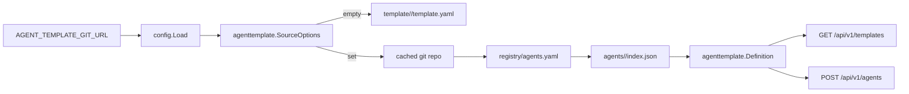

# 技术设计: 外部模板 Git 源接入

## 技术方案
### 核心技术
- Go 标准库 `net/http + archive/zip` 下载 GitHub zipball；非 GitHub URL 保留 `git` CLI 兜底。
- `sigs.k8s.io/yaml` 解析 registry 与 deploy yaml。
- 现有 `agenttemplate.Definition` 作为内部统一模型，避免前端 DTO 扩散。

### 实现要点
- `config.Config` 新增 `AgentTemplateGitURL` 与可选缓存目录。
- `agenttemplate.SourceOptions` 统一承载本地模板目录和外部 Git 模板源。
- `agenttemplate.ListFromSource` / `ResolveFromSource` 在 Git URL 存在时优先读取外部模板仓库，否则沿用本地模板目录。
- 外部仓库读取流程：GitHub zipball 下载/缓存（非 GitHub URL fallback 到 clone/fetch）→ 读取 `registry/agents.yaml` → 遍历 enabled entries → 读取 `index.json` → 读取 `deploy.yaml` 中首个 container 的 image/args/workingDir/env。
- 外部模板继承内置同 id 模板的能力 schema、workspace、access、bootstrap、manifest，以保持现有部署与设置链路稳定；外部仓库只覆盖 name/description/image/defaultArgs/workingDir/presentation 等发布态元数据。
- GitHub 源中的 `agent-hub/<name>:<tag>` 占位镜像会映射到 `ghcr.io/<owner>/<name>:<tag>`；外部模板默认工作目录固定为 `/workspace`，避免回退到内置 Hermes/OpenClaw 的旧工作目录。
- 如果外部 `config.json` 声明 `model:set-main`，后端会桥接现有模型选择字段；部署与设置更新通过 `/opt/agent/config.sh` best-effort 应用 provider/model/gateway 契约。
- 控制台终端默认进入 `/workspace`，同时允许跳到容器内其他绝对路径；文件工作台接入目录预取、下载与删除入口，保证外部 Agent 容器能正常管理文件。

## 架构设计

## 架构决策 ADR
### ADR-20260427-01: 外部模板仓库先作为目录/镜像/配置契约源
**上下文:** 外部模板仓库的 `deploy.yaml` 当前是通用 Kubernetes Deployment，而 Agent Hub 运行时依赖 Devbox CRD 承载 SSH、终端、文件、状态和 ingress 能力。
**决策:** 本轮不直接 apply 外部 `deploy.yaml`，而是从中读取镜像、启动参数、工作目录等部署元数据，投影到现有 Devbox 模板定义。
**理由:** 可以快速对齐真实镜像来源，同时不破坏现有 Agent Contract、bootstrap、文件/终端能力。
**替代方案:** 直接改为 apply 外部 Deployment → 拒绝原因: 会绕开当前 Devbox 语义，影响面过大，且需要重做状态/访问/终端/文件链路。
**影响:** 后续如果要支持非 Devbox runtime，可在外部模板 `runtime.kind` 上新增显式部署策略，而不是隐式套用任意 YAML。

## API设计
- 不新增 API。
- `GET /api/v1/templates` 保持既有字段，并在外部模板存在 `config.json/config.sh` 时追加可选 `config` 路径契约。
- `POST /api/v1/agents` 请求字段不变，部署镜像跟随解析出的模板定义。

## 安全与性能
- **安全:** 不执行外部 `config.sh`；只读取文件并解析元数据，避免远程仓库代码执行。
- **安全:** 只在服务器启动/请求解析模板时使用配置的 Git URL，不接受用户请求传入 URL。
- **性能:** Git 仓库缓存到本地目录，并设置短 TTL，避免每次请求都 clone/fetch。

## 测试与部署
- **测试:** 新增 agenttemplate 外部仓库 fixture 测试、config env 测试、handler resolve cache key 测试。
- **验证:** 使用真实 `Agent-Hub-Template` GitHub 源临时测试过 `hermes-agent/openclaw` 均解析为 `ghcr.io/nightwhite/*:dev`，且 OpenClaw 端口/工作目录解析为 `18789` 与 `/workspace`。
- **部署:** 后端部署环境增加 `AGENT_TEMPLATE_GIT_URL=https://github.com/nightwhite/Agent-Hub-Template.git`。
