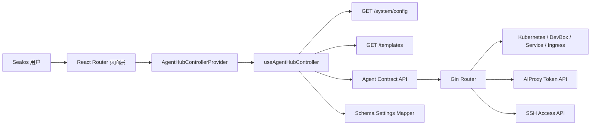
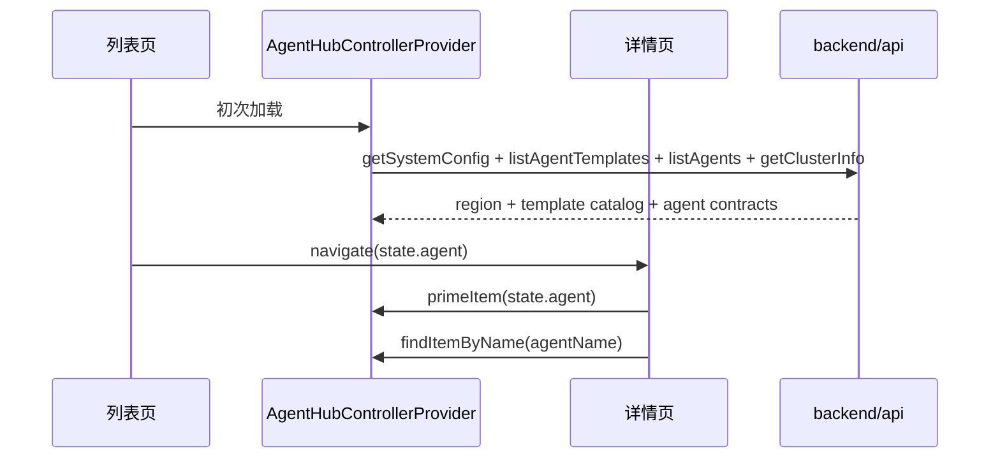

# 架构设计

## 总体架构

## 前端状态流

## 关键设计点
- 路由共享同一个 `AgentHubControllerProvider`，列表页、模板页、创建页、详情页只消费一份 contract 快照。
- 前端模板权威已收回到后端：`/api/v1/templates` 提供模板目录、访问能力、动作、设置 schema 和按 `REGION` 裁剪后的模型预设。
- Agent 页面权威已切到 Contract V1：列表和详情统一消费 `core / workspaces / access / runtime / settings / actions`，不再允许通过镜像、域名、模型名做推断。
- `useAgentHubController` 只在实例处于 `creating` 或 `running but not ready` 时静默轮询，避免常态页面持续刷新。
- 详情页侧边工作区改为 contract 驱动：`overview / chat / terminal / files / settings / web-ui` 只在模板显式声明时出现。
- 设置平面已拆成两条显式更新链路：`PATCH /api/v1/agents/:agentName/runtime` 与 `PATCH /api/v1/agents/:agentName/settings`，不再保留宽泛更新接口。
- `settings` 字段新增 binding 语义：模板可显式声明某个字段写入 `agent built-in / env / annotation / derived`，创建与更新统一走同一份 schema 映射。
- SSH / IDE 接入走按需链路：列表 contract 只暴露入口能力，真正的私钥、token、config host 仅通过 `/api/v1/agents/:agentName/access/ssh` 返回。
- 发布顺序固定为“后端先发、前端后发、模板目录与知识库最后同步”，不保留旧 DTO 过渡窗口。

## 重大架构决策

| adr_id | title | date | status | affected_modules | details |
|--------|-------|------|--------|------------------|---------|
| ADR-20260418-01 | Agent Hub 页面改为共享 controller + 导航快照 | 2026-04-18 | ✅已采纳 | web/app/pages/agent-hub | 通过 Provider 与 route state 降低重复请求与状态滞后 |
| ADR-20260418-02 | Agent Hub 切换到 Template Catalog + Agent Contract V1 | 2026-04-18 | ✅已采纳 | backend/internal/handler, web/src/domains/agents | 模板能力、模型预设、访问平面和动作入口全部显式化，删除前端推断链 |
| ADR-20260418-03 | Agent Hub 工作区与设置字段改为模板 schema 显式绑定 | 2026-04-18 | ✅已采纳 | backend/internal/agenttemplate, backend/internal/handler, web/src/app/pages/agent-hub | 通过 `workspaces + settings.binding` 让工作区和设置写入都回到模板目录单一路径 |
